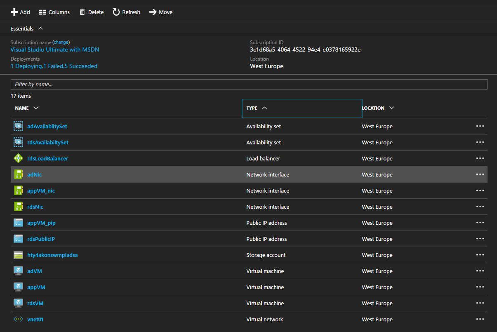
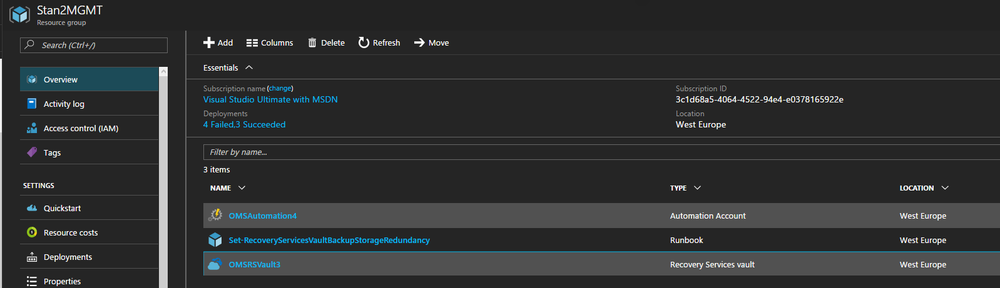

# Azure Foundation Lite

## Prerequisites

1. Install AzureRM modules

```powershell
Find-Module -Name AzureRM | Install-Module -Scope AllUsers -Force -AllowClobber
```

2. Install Azure.Storage module

```powershell
Find-Module -Name Azure.Storage | Install-Module -Scope AllUsers -Force -AllowClobber 
```

## Deployment Steps  

1. Edit azuredeploy.parameters.json and azuredeploymanagement.parameters.json in `project\AzureFoundationLite`
2. Run deploy.ps1 script with values for parameters ResourceGroupName,  ResourceGroupLocation and MGMTResourceGroupName
3. When you run it you will be asked to login to Azure.
4. When you are logged in you will be asked to choose a subscription for deploying the resources.
5. After successful deployment the following resources are created





## Known Errors

1. If you have Azure SDK installed before installing/updating the Azure.Storage or AzureRM and recive the following error;
```powershell
    PackageManagement\Install-Package : Cannot process argument transformation on parameter 'InstalledModuleInfo'. Cannot convert the     "System.Object[]" value of type "System.Object[]" to type "System.Management.Automation.PSModuleInfo".
Find-Module -Name Azure.Storage | Install-Module -Scope AllUsers -Force -AllowClobber 
```

You might want to try to delete Azure* folders from below locations.

%ProgramFiles%\WindowsPowerShell\Modules folder
%ProgramFiles(x86)%\Microsoft SDKs\Azure\PowerShell
  
